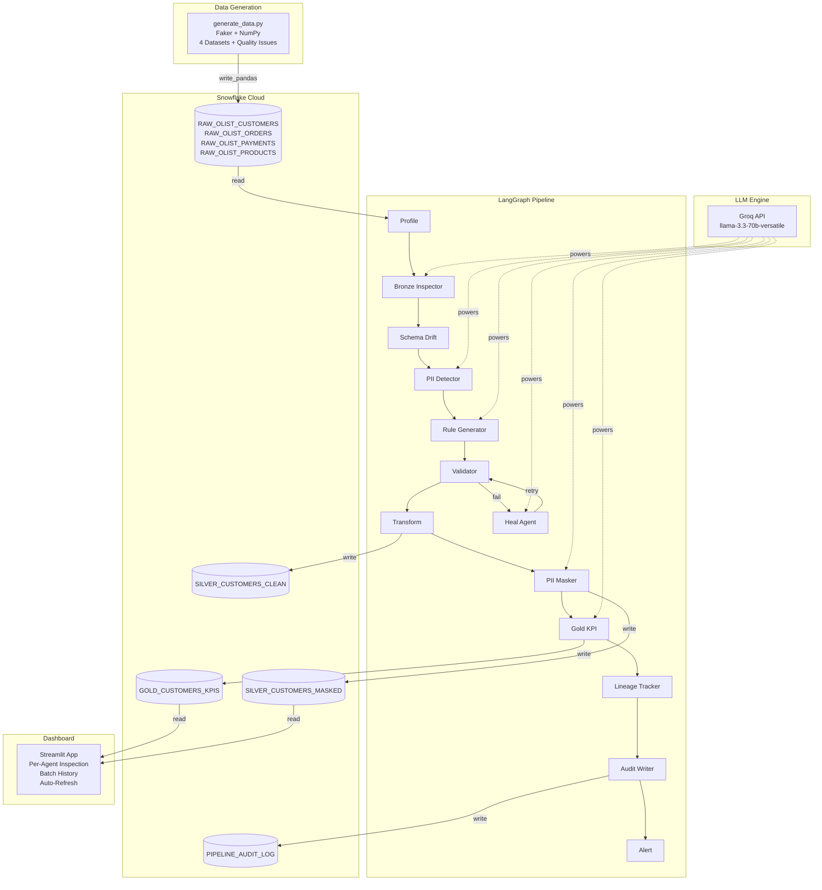
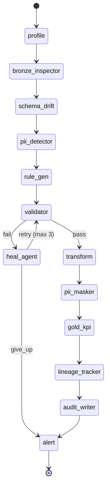
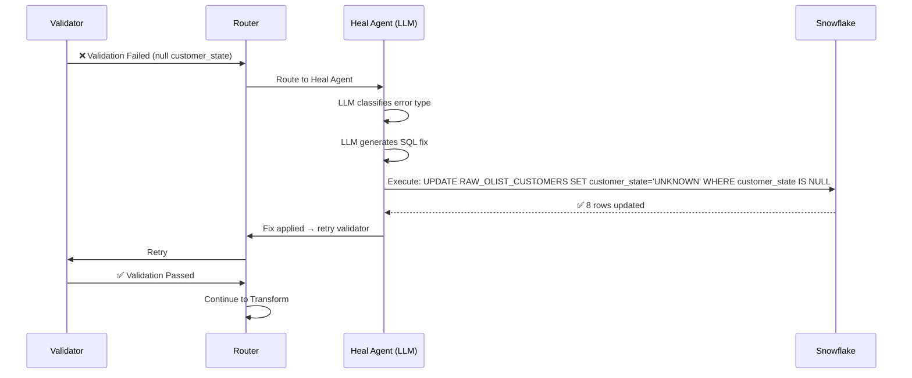

# 🔮 GEN AI Capstone-2 — Olist LLM Data Pipeline

## Autonomous Self-Healing Data Quality Pipeline with LLM on Every Node

---

## 📋 Table of Contents

1. [Project Overview](#project-overview)
2. [Architecture](#architecture)
3. [Medallion Architecture (Bronze → Silver → Gold)](#medallion-architecture)
4. [Pipeline Agents (11 Nodes)](#pipeline-agents)
5. [Self-Healing Mechanism](#self-healing-mechanism)
6. [Technology Stack](#technology-stack)
7. [Project Structure](#project-structure)
8. [Data Flow](#data-flow)
9. [Snowflake Integration](#snowflake-integration)
10. [PII Detection & Masking](#pii-detection--masking)
11. [Dashboard](#dashboard)
12. [Configuration](#configuration)
13. [How to Run](#how-to-run)
14. [Key Design Decisions](#key-design-decisions)
15. [Results & Metrics](#results--metrics)

---

## 1. Project Overview

This project implements a **fully autonomous, self-healing data pipeline** for the **Olist Brazilian E-Commerce** dataset. The pipeline uses **LLM (Large Language Model) agents on every layer** — from data ingestion to business intelligence — orchestrated via **LangGraph** with **Snowflake** as the cloud data warehouse.

### Key Capabilities

| Capability | Description |
|-----------|-------------|
| **LLM on Every Node** | Groq Llama-3.3-70b inspects, validates, heals, and generates insights at every pipeline stage |
| **Self-Healing** | Failed nodes trigger an LLM-powered Heal Agent that diagnoses and fixes issues autonomously |
| **Medallion Architecture** | Bronze (raw) → Silver (clean + masked) → Gold (KPIs + insights) |
| **PII Protection** | LLM detects PII columns; SHA-256 hashing for HIGH risk, partial masking for MEDIUM |
| **Schema Drift Detection** | Automatic comparison against reference schema to detect column additions, removals, type changes |
| **Continuous Operation** | Generates fresh batches with injected quality issues, processes them, and updates Snowflake in a loop |
| **Live Dashboard** | Streamlit dashboard with per-agent inspection, batch history, and auto-refresh |

---

## 2. Architecture

### High-Level Architecture Diagram



### Orchestration: LangGraph StateGraph

The pipeline is built as a **LangGraph StateGraph** — a directed acyclic graph where each node is an autonomous agent. All agents communicate through a shared **AgentState** (TypedDict) — no agent calls another directly.



---

## 3. Medallion Architecture

```
┌─────────────────────────────────────────────────────────────────────┐
│                        BRONZE LAYER (Raw)                           │
│  RAW_OLIST_CUSTOMERS / ORDERS / PAYMENTS / PRODUCTS                │
│  • Raw data with injected quality issues                           │
│  • Nulls, bad formats, duplicates, invalid states                  │
│  • LLM inspects, detects drift, classifies PII, generates rules   │
│  • Validator checks rules → Heal Agent fixes failures             │
├─────────────────────────────────────────────────────────────────────┤
│                        SILVER LAYER (Clean)                         │
│  SILVER_CUSTOMERS_CLEAN → SILVER_CUSTOMERS_MASKED                  │
│  • Clean rows after transform (dedup, null removal)               │
│  • PII columns masked: SHA-256 (HIGH) / Partial (MEDIUM)          │
│  • Typically 92-96% of Bronze rows pass to Silver                 │
├─────────────────────────────────────────────────────────────────────┤
│                        GOLD LAYER (Business)                        │
│  GOLD_CUSTOMERS_KPIS                                               │
│  • 7 KPIs: total_customers, unique_customers, states_covered,     │
│    cities_covered, top_states, top_cities, null_rate_pct          │
│  • 3 LLM-generated business insights per batch                    │
└─────────────────────────────────────────────────────────────────────┘
```

---

## 4. Pipeline Agents (11 Nodes)

### 🟤 Bronze Layer Agents

| # | Agent | File | LLM? | Purpose |
|---|-------|------|------|---------|
| 1 | **Profile** | `agents/nodes/profile.py` | ❌ | Reads Snowflake RAW table → extracts schema, row count, sample rows |
| 2 | **Bronze Inspector** | `agents/nodes/bronze_inspector.py` | ✅ | LLM scans every column for nulls, format errors, invalid values |
| 3 | **Schema Drift** | `agents/nodes/schema_drift.py` | ❌ | Compares current schema vs reference → detects COLUMN_ADDED, TYPE_CHANGED |
| 4 | **PII Detector** | `agents/nodes/pii_detector.py` | ✅ | LLM classifies columns into HIGH / MEDIUM / LOW / NONE PII risk |
| 5 | **Rule Generator** | `agents/nodes/rule_gen.py` | ✅ | LLM generates Great Expectations validation rules from data profile |
| 6 | **Validator** | `agents/nodes/validator.py` | ❌ | Executes GE rules. On failure → triggers Heal Agent |

### ⚪ Silver Layer Agents

| # | Agent | File | LLM? | Purpose |
|---|-------|------|------|---------|
| 7 | **Transform** | `agents/nodes/transform.py` | ❌ | Splits data into clean (Silver) and quarantine. Deduplication applied |
| 8 | **PII Masker** | `agents/nodes/pii_masker.py` | ✅ | Applies SHA-256 (HIGH) or partial mask (MEDIUM) to PII columns |

### 🟡 Gold Layer Agent

| # | Agent | File | LLM? | Purpose |
|---|-------|------|------|---------|
| 9 | **Gold KPI** | `agents/nodes/gold_kpi.py` | ✅ | Computes 7 KPIs + generates 3 LLM business insights |

### 📋 Audit Agents

| # | Agent | File | LLM? | Purpose |
|---|-------|------|------|---------|
| 10 | **Lineage Tracker** | `agents/nodes/lineage_tracker.py` | ❌ | Records data lineage across all layers to Snowflake |
| 11 | **Audit Writer** | `agents/nodes/audit_writer.py` | ❌ | Writes structured audit log (JSON) to PIPELINE_AUDIT_LOG |
| 12 | **Alert** | `agents/nodes/alert.py` | ✅ | Generates final audit report. Terminal node: SUCCESS or ESCALATED |

### 🔧 Self-Healing Agent

| Agent | File | LLM? | Purpose |
|-------|------|------|---------|
| **Heal Agent** | `agents/nodes/heal_agent.py` | ✅ | Diagnoses failures, generates SQL fixes, applies them to Snowflake |

---

## 5. Self-Healing Mechanism



### Heal Agent Features

- **Error Classification**: LLM classifies error as `data_quality_error`, `invalid_llm_output`, `timeout`, or `unknown`
- **SQL Fix Generation**: For data quality errors, LLM writes Snowflake SQL to fix the issue
- **Max Retries**: 3 retries per node before escalating to manual review
- **Retry Logging**: Every heal attempt is logged with retry number, error type, and fix applied

---

## 6. Technology Stack

| Component | Technology | Purpose |
|-----------|-----------|---------|
| **Orchestration** | LangGraph (StateGraph) | DAG-based pipeline with conditional routing |
| **LLM** | Groq (llama-3.3-70b-versatile) | High-speed inference for all LLM agents |
| **Data Warehouse** | Snowflake | Cloud storage for Bronze/Silver/Gold tables |
| **Data Generation** | Faker (pt_BR) + NumPy | Realistic Brazilian e-commerce data with quality issues |
| **Validation** | Great Expectations (in-memory) | Data quality rule execution |
| **Dashboard** | Streamlit + Plotly | Real-time pipeline monitoring |
| **Logging** | Loguru | Structured, colorful logging |
| **Config** | python-dotenv | Environment-based configuration |
| **Language** | Python 3.11 | Core runtime |

---

## 7. Project Structure

```
GEN_AI_Capstone-2/
├── agents/
│   ├── state.py                    # AgentState TypedDict — shared communication bus
│   └── nodes/
│       ├── profile.py              # Node 1: Schema profiler
│       ├── bronze_inspector.py     # Node 2: LLM data quality inspector
│       ├── schema_drift.py         # Node 3: Schema drift detector
│       ├── pii_detector.py         # Node 4: LLM PII classifier
│       ├── rule_gen.py             # Node 5: LLM rule generator
│       ├── validator.py            # Node 6: GE rule executor
│       ├── heal_agent.py           # Heal Agent: LLM error diagnosis + SQL fix
│       ├── transform.py            # Node 7: Clean/quarantine splitter
│       ├── pii_masker.py           # Node 8: LLM PII masker
│       ├── gold_kpi.py             # Node 9: LLM KPI + insights engine
│       ├── lineage_tracker.py      # Node 10: Data lineage recorder
│       ├── audit_writer.py         # Node 11: Audit log writer
│       └── alert.py                # Node 12: Terminal alert node
├── pipeline/
│   ├── graph.py                    # LangGraph StateGraph definition
│   ├── runner.py                   # Pipeline execution orchestrator
│   ├── batch_generator.py          # Batch data generator
│   ├── batch_state.py              # Batch state management
│   ├── cumulative_store.py         # Cross-batch state accumulator
│   └── layer_healer.py             # Layer-level healing logic
├── tools/
│   ├── llm_client.py               # Unified LLM client (Groq/OpenAI/Anthropic)
│   └── snowflake_mcp_tool.py       # MCP tool: read/write/append to Snowflake
├── config/
│   ├── settings.py                 # Configuration from .env
│   └── logger.py                   # Loguru configuration
├── generate_data.py                # Data generator: 4 datasets → Snowflake
├── run_continuous.py               # Main entry: continuous generate + pipeline loop
├── streamlit_app.py                # Dashboard: per-agent inspection + batch history
├── setup_snowflake.py              # One-time Snowflake schema setup
├── metadata/
│   └── batch_history.json          # Per-batch detailed results
├── logs/                           # Audit reports and pipeline logs
├── requirements.txt                # Python dependencies
├── .env                            # API keys and Snowflake credentials
└── DOCUMENTATION.md                # This file
```

---

## 8. Data Flow

### Generated Datasets

| Dataset | Table | Rows per Batch | Injected Quality Issues |
|---------|-------|----------------|------------------------|
| **Customers** | `RAW_OLIST_CUSTOMERS` | ~202 | ~4 null IDs, ~8 null states, ~6 bad states, ~2 dupes |
| **Orders** | `RAW_OLIST_ORDERS` | ~240 | ~7 null customer IDs, ~7 bad statuses |
| **Payments** | `RAW_OLIST_PAYMENTS` | ~280 | ~5 null values, ~8 bad types, ~8 negative values |
| **Products** | `RAW_OLIST_PRODUCTS` | ~160 | ~9 null categories, ~6 null weights |

### Pipeline Processing (per batch)

```
Input:  202 raw rows (Bronze)
  ↓ LLM Inspector detects ~3 issues
  ↓ Schema Drift detects ~7-9 events
  ↓ PII Detector classifies 9 columns
  ↓ Rule Generator creates GE rules
  ↓ Validator runs rules → Heal Agent fixes nulls
  ↓ Transform: 185-193 clean rows → Silver
  ↓ PII Masker: SHA-256 email+phone, partial mask IDs+zip
  ↓ Gold KPI: 7 KPIs + 3 business insights
Output: 185-193 clean, masked rows (Silver) + 7 KPIs (Gold)
```

---

## 9. Snowflake Integration

### MCP Tool (`tools/snowflake_mcp_tool.py`)

All Snowflake operations go through a unified MCP (Model Context Protocol) tool:

| Operation | Method | Description |
|-----------|--------|-------------|
| `snowflake_read_table` | SELECT * | Read entire table into DataFrame |
| `snowflake_write_df` | DROP + write_pandas | Write DataFrame (replaces table) |
| `snowflake_append_json` | INSERT via parameterized SQL | Append JSON record to audit/lineage tables |
| `snowflake_run_sql` | Raw SQL execution | Used by Heal Agent for UPDATE/DELETE fixes |

### Tables Created

| Table | Layer | Description |
|-------|-------|-------------|
| `RAW_OLIST_CUSTOMERS` | Bronze | Raw customer data with quality issues |
| `RAW_OLIST_ORDERS` | Bronze | Raw order data |
| `RAW_OLIST_PAYMENTS` | Bronze | Raw payment data |
| `RAW_OLIST_PRODUCTS` | Bronze | Raw product data |
| `SILVER_CUSTOMERS_CLEAN` | Silver | Cleaned, deduplicated customer data |
| `SILVER_CUSTOMERS_MASKED` | Silver | PII-masked customer data |
| `GOLD_CUSTOMERS_KPIS` | Gold | Business KPIs and metrics |
| `PIPELINE_AUDIT_LOG` | Audit | Structured operational audit log |

---

## 10. PII Detection & Masking

### Detection (LLM-powered)

The PII Detector prompts the LLM to classify every column:

| Column | PII Level | Reason |
|--------|-----------|--------|
| `customer_email` | 🔴 HIGH | Directly identifies a person |
| `customer_phone` | 🔴 HIGH | Directly identifies a person |
| `customer_id` | 🟡 MEDIUM | Indirectly identifies a person |
| `customer_unique_id` | 🟡 MEDIUM | Indirectly identifies a person |
| `customer_zip_code_prefix` | 🟡 MEDIUM | Indirectly identifies location |
| `customer_city` | 🟢 LOW | Contextual, not identifying |
| `customer_state` | 🟢 LOW | Contextual, not identifying |
| `batch_id` | ⚪ NONE | System metadata |
| `ingested_at` | ⚪ NONE | Timestamp |

### Masking Strategy

| Level | Action | Example |
|-------|--------|---------|
| **HIGH** | SHA-256 hash | `arthur@example.com` → `dfe938a7b2c1...` |
| **MEDIUM** | Partial mask (first 4 chars + `****`) | `460b977d-3f4b` → `460b****...` |
| **LOW** | Not masked | `recife` → `recife` |
| **NONE** | Not masked | `2026-05-13` → `2026-05-13` |

---

## 11. Dashboard

### Streamlit Dashboard (`streamlit_app.py`)

The dashboard provides **per-agent inspection** for every batch:

- **Batch Selector**: Dropdown to choose any historical batch
- **Per-Agent Expandable Sections**: Click to see what each agent found
- **Live Metrics**: Bronze/Silver/Masked/Gold row counts
- **Batch History Charts**: Rows per batch, duration & status, heal trend
- **Snowflake Data Viewer**: Browse Bronze, Silver, Masked tables

### Auto-Refresh

Dashboard auto-refreshes every 30 seconds via `streamlit-autorefresh` to show live pipeline results.

---

## 12. Configuration

### Environment Variables (`.env`)

```env
# LLM Provider
LLM_PROVIDER=groq
LLM_MODEL=llama-3.3-70b-versatile
GROQ_API_KEY=gsk_...

# Snowflake
SNOWFLAKE_ACCOUNT=XXXXX-YYYYY
SNOWFLAKE_USER=USERNAME
SNOWFLAKE_PASSWORD=PASSWORD
SNOWFLAKE_WAREHOUSE=COMPUTE_WH
SNOWFLAKE_DATABASE=MY_DB
SNOWFLAKE_SCHEMA=PUBLIC
SNOWFLAKE_ROLE=SYSADMIN
```

### Supported LLM Providers

| Provider | Model | Speed | Cost |
|----------|-------|-------|------|
| **Groq** | llama-3.3-70b-versatile | ⚡ Fastest | Free tier (100K TPD) |
| **OpenAI** | gpt-4o | Fast | Paid |
| **Anthropic** | claude-3.5-sonnet | Fast | Paid |

---

## 13. How to Run

### Prerequisites

```bash
pip install -r requirements.txt
```

### One-Time Setup

```bash
python3 setup_snowflake.py    # Create Snowflake schema
```

### Run Options

```bash
# Single batch (generate + pipeline)
python3 run_continuous.py --once --rows 200

# 5 batches
python3 run_continuous.py --batches 5 --rows 200

# Continuous loop (generates ALL 4 datasets each batch)
python3 run_continuous.py --loop --rows 200 --interval 45

# Generate data only (no pipeline)
python3 generate_data.py --rows 500

# Start dashboard
streamlit run streamlit_app.py --server.port 8501
```

### CLI Flags

| Flag | Default | Description |
|------|---------|-------------|
| `--rows` | 200 | Number of customers per batch |
| `--interval` | 60 | Seconds between batches (loop mode) |
| `--batches` | 0 | Max batches (0 = infinite) |
| `--once` | false | Run one batch and exit |
| `--loop` | false | Loop indefinitely |

---

## 14. Key Design Decisions

| Decision | Rationale |
|----------|-----------|
| **LangGraph StateGraph** | Enables conditional routing (pass/fail → heal) without nodes calling each other directly |
| **Shared AgentState TypedDict** | Single communication bus — all 12 nodes read/write from the same state object |
| **DROP + recreate tables** | Handles schema evolution across batches without manual DDL changes |
| **Parameterized SQL for JSON** | Prevents SQL injection errors from special characters in audit log content |
| **UPPERCASE column names** | Snowflake default — all column names uppercased before write to prevent identifier errors |
| **Quarantine at Transform** | Deduplication handled at Silver layer, not validator — prevents false validation failures |
| **Max 3 retries** | Prevents infinite heal loops while giving the LLM enough attempts to fix issues |
| **String conversion for PII masking** | ZIP codes stored as int cause `'int' object is not subscriptable` — cast to str before slicing |

---

## 15. Results & Metrics

### Typical Batch Results

| Metric | Value |
|--------|-------|
| Bronze Raw Rows | 202 |
| Silver Clean Rows | 185–193 |
| Pass Rate | 92–96% |
| Masked Rows | 185–193 |
| Gold KPIs | 7 |
| LLM Business Insights | 3 |
| Heal Events | 2 (avg) |
| Schema Drift Events | 7–9 |
| Pipeline Duration | 20–30s |

### Sample LLM Business Insights

> **[QUALITY]** All 193 customers have unique records with 0.0% null rate, suggesting high data quality.

> **[GEOGRAPHY]** Top 5 states (ES, SE, RR, AL, RN) account for 55 customers — potential for targeted marketing.

> **[REVENUE]** São Paulo has the highest customer count (18), presenting revenue growth opportunities.

---

## 📜 License

GEN AI Capstone-2 — Sigmoid Data Engineering Program

---

*Built with LangGraph · Groq · Snowflake · Streamlit*
