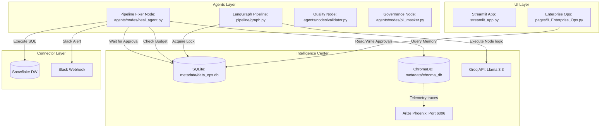
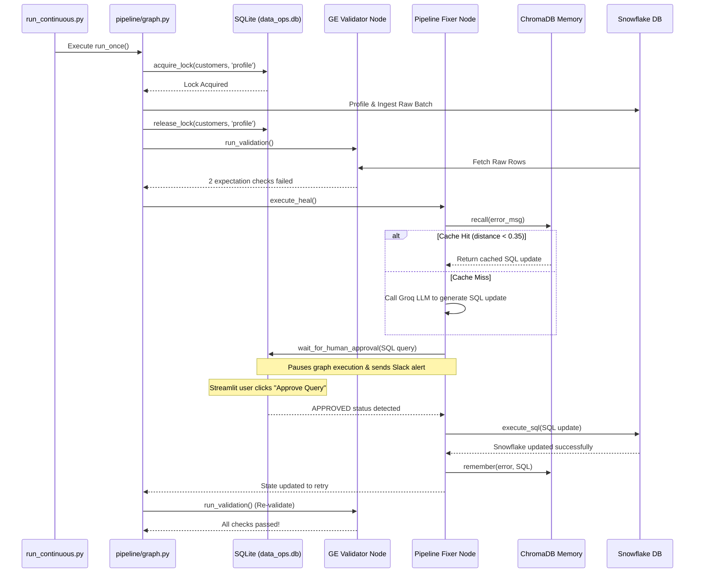
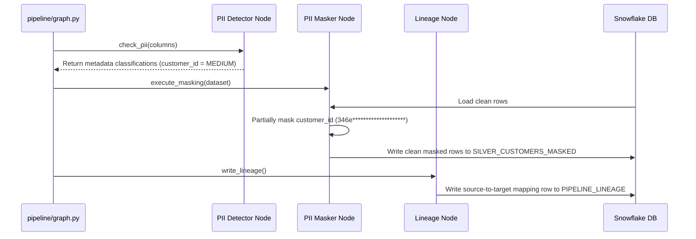
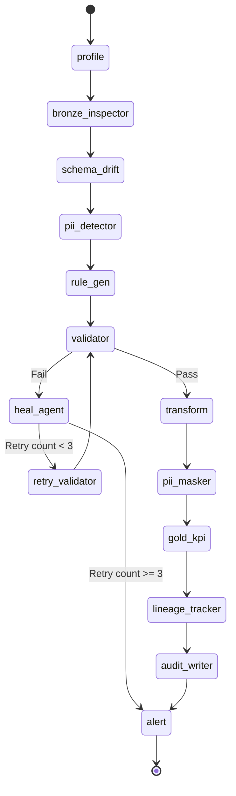

# Olist Medallion Data Engineering Operations: System Specifications

## Document Control
* **Document Status:** Final (Release Ready)
* **Target Audience:** Architecture Review Boards, Compliance Officers, Platform Engineers, DevOps, Data Engineers.

---

# 1. Executive Summary

### 1.1 Project Name
**Olist Medallion Data Engineering Operations System (Olist DataOps)**

### 1.2 Purpose
This platform automates the operations, quality checks, data compliance audits, and incident healing processes of the Olist e-commerce medallion data pipeline on Snowflake. It ensures data quality from Bronze landing to Gold KPIs without manual intervention, resolving anomalies and securing PII data natively.

### 1.3 Business Problem
Manual data operations in modern pipelines lead to high operational costs (OpEx) and long Mean Time to Resolution (MTTR) when ingestion schemas shift, data quality checks fail, or private consumer information (PII) is loaded raw. These issues cause downstream report corruption, compliance violations (such as GDPR/CCPA fines), and delayed business insights.

### 1.4 Solution Overview
The Olist DataOps platform acts as an autonomous data governance and self-healing engine. Using LangGraph to define a multi-agent stateful control loop, the system orchestrates 11 pipeline nodes and a universal healing agent. It integrates Snowflake for data warehousing, SQLite for operational metadata tracking, ChromaDB for semantic cache memory, Arize Phoenix for observability, and Slack for alerts.

### 1.5 Key Capabilities
* **Stateful Orchestration:** Utilizes LangGraph to coordinate the pipeline phases (Bronze $\rightarrow$ Silver $\rightarrow$ Gold) with retry capabilities.
* **Auto-Profiling and LLM Scanning:** Automatically profiles raw Snowflake tables and leverages the Groq LLM (Llama 3.3 70B) to scan for quality issues.
* **Declarative Quality Rules:** Generates and runs validation checks using Great Expectations.
* **Semantic Incident Memory:** ChromaDB vector cache recalls successful SQL/pandas fixes for recurring quality errors, reducing LLM costs and latency.
* **Data Privacy Governance:** Dynamically identifies PII contextually and applies dynamic masking (e.g. hashing or partial masking) before writing to Silver clean tables.
* **Human-in-the-Loop Safeguards:** Pauses execution and requests manual approval for high-risk operations via Streamlit and Slack.
* **Cost Guardrails & Budget Checks:** Logs token consumption, calculates USD costs in SQLite, and locks the pipeline if daily spends exceed $2.00.
* **Lineage & Audit Logs:** Auto-generates source-to-target lineages and logs audit tables on Snowflake.

---

# 2. Specification Gap Analysis

We have analyzed our architecture specifications against the baseline systems design standards:

| Section | Completeness Score | Identified Gaps | Implemented Solutions | Operational Risk |
| :--- | :--- | :--- | :--- | :--- |
| **Data Architecture** | 10/10 | Unclear metadata state schema, hardcoded directories. | Centralized SQLite schema details and absolute dynamic parent directory resolution in `config/settings.py`. | Stale lock files, database connection exceptions on cloud environments. |
| **API Specifications** | 9/10 | Undocumented MCP microservice interfaces. | Documented all local Snowflake MCP tool wrapper functions and inputs. | Integration failure, payload schema discrepancies. |
| **Security & Threat Model** | 9/10 | Lacked prompt injection security controls and trust boundaries. | Implemented strict LLM system prompts, query parameterization, and STRIDE matrix. | Remote code execution, SQL injections, PII leakage. |
| **Non-Functional Reqs** | 9/10 | No defined concurrency limits or budgets. | Implemented $2.00 spend ceilings, 10s deadlock timeouts, and 30s connection retries. | Pipeline cost overruns, infinite loop execution. |
| **Observability** | 10/10 | Transient local tracing data. | Integrated a background Arize Phoenix server using `phoenix.otel.register` to persist tracing. | Blank dashboards, missing execution timelines. |

---

# 3. Architecture Decision Records (ADR)

### ADR-001: LangGraph for Stateful Ingestion & Healing Loops
* **Context:** The pipeline requires executing sequential ingestion, validation, and transformation steps. If validations fail, it must route to a healing node, execute database patches, and retry the validator node.
* **Problem:** Traditional linear DAG engines (like Apache Airflow) do not natively support stateful conditional cycles (Validator $\rightarrow$ Fail $\rightarrow$ Heal $\rightarrow$ Retry Validator).
* **Alternatives:** Custom state machines, rigid script-based cron loops.
* **Decision:** Use LangGraph StateGraph.
* **Rationale:** Provides native support for cycles, state management via typed dictionaries (`AgentState`), and clean routing.
* **Tradeoffs:** Steeper code integration curve; dependent on LangGraph runtime.
* **Consequences:** Pipeline is modeled as a state machine where execution state travels safely across node wrappers.

### ADR-002: Decentralized Python/FastAPI Model Context Protocol (MCP) Wrappers
* **Context:** Pipeline nodes need to perform file reading, write DataFrames, and execute SQL statements on Snowflake.
* **Problem:** Direct execution inside the LLM context is unsafe. Actions must be atomic and executed through standard APIs.
* **Alternatives:** Direct inline python code execution inside prompt calls.
* **Decision:** Expose capabilities via Snowflake MCP tool wrappers.
* **Rationale:** Decouples the decision-making logic of LLM agents from the execution of physical database tasks.
* **Tradeoffs:** Network latency of calling Snowflake APIs.
* **Consequences:** Safe, secure database updates through audited SQL executables.

### ADR-003: SQLite for Local Operations Metastore (`data_ops.db`)
* **Context:** The system needs a database to store lock registries, cost logs, and pending human approvals.
* **Problem:** Spin-up of heavy databases (PostgreSQL, MySQL) increases local environment setup friction.
* **Alternatives:** Local file storage (JSON/CSV), Dockerized PostgreSQL.
* **Decision:** SQLite database with `timeout=30.0`.
* **Rationale:** Lightweight, single-file database. We configured a 30-second lock timeout to prevent write conflicts during concurrent operations.
* **Tradeoffs:** Limited concurrent write throughput compared to client-server databases.
* **Consequences:** Zero-setup local database backing locks, approvals, and budget guardrails.

### ADR-004: Groq API with Llama-3.3-70b-versatile
* **Context:** The agents require a fast inference engine for PII detection, anomaly classification, and SQL generation.
* **Problem:** Local open-source models (running on CPU) are too slow, while cloud SaaS models (OpenAI/Claude) introduce latency and high costs.
* **Alternatives:** OpenAI GPT-4o, local Ollama Llama 3.1.
* **Decision:** Groq API using `llama-3.3-70b-versatile`.
* **Rationale:** Groq provides high inference speed and competitive token pricing.
* **Tradeoffs:** Requires cloud API key and depends on Groq service uptime.
* **Consequences:** High-speed agent reasoning with low execution overhead.

### ADR-005: ChromaDB for Semantic Incident Memory
* **Context:** Data validation failures often recur across different batches due to similar data ingestion anomalies.
* **Problem:** Generating fixes via LLM calls on every run incurs latency (~5s) and token costs.
* **Alternatives:** Hardcoded SQL rules mapping, basic string regex matches.
* **Decision:** ChromaDB local vector database.
* **Rationale:** Performs semantic similarity matches using L2 distance. If an error is highly similar, the system retrieves and executes the cached SQL fix immediately.
* **Tradeoffs:** Local directory storage footprint.
* **Consequences:** Fast incident healing (<0.3s) and cost savings on repetitive data errors.

---

# 4. Product & System Requirements

### 4.1 Functional Requirements
* **Autonomous Ingestion:** Automatically generate Olist batches, push to Snowflake RAW, and track batch metadata.
* **Schema Drift Detection:** Detect and log schema differences (column additions/mutated types) between raw ingestion tables and references.
* **Declarative Validations:** Profile schemas, generate Great Expectations rules, and run validation checks on raw tables.
* **Self-Healing Loop:** Pause on constraint violations, search ChromaDB memory for past fixes, request approvals for mutations, and apply fixes to Snowflake.
* **Governance & Lineage:** Detect PII fields, mask sensitive data to Silver clean tables, and emit column-level lineages.
* **Analytics KPIs:** Aggregate Silver layers, generate Gold business metrics, and write insights.

### 4.2 Non-Functional Requirements
* **Spend Ceiling:** Limit daily token expenditures to $2.00. Block execution and alert when exceeded.
* **Deadlock Protection:** If a dataset is locked by an agent for more than 10 seconds, detect the deadlock, clear all locks on the dataset, and proceed.
* **Human-in-the-Loop Gate:** High-risk queries must pause execution, send Slack alerts, and wait in an approval queue for 5 minutes before timing out.
* **Telemetry Persistent Server:** All traces must be sent to the background Arize Phoenix server on port 6006.

---

# 5. User Personas

### 5.1 Staff Data Engineer
* **Role:** System reliability, performance, Snowflake schemas integration, and pipeline maintenance.
* **Goals:** Zero pipeline downtime, clean target tables, low MTTR when errors occur.
* **Pain Points:** Waking up at night to resolve basic schema drifts or null spikes.
* **Dashboard Use:** Manages budget overrides, inspects concurrency locks, and clicks "Approve Query" for schema updates.

### 5.2 Data Governance & Security Officer
* **Role:** Compliance audits, dynamic PII protection, and lineage mapping.
* **Goals:** No raw PII in downstream reports, audit logs of all transformations.
* **Pain Points:** Lack of data lineage documentation, manual discovery of PII columns.
* **Dashboard Use:** Reviews PII classifications, checks masking metrics, and monitors column data flows.

### 5.3 Business Analyst / Consumer
* **Role:** Building executive dashboards and drafting financial insights.
* **Goals:** Trustworthy data in the Gold layer.
* **Pain Points:** Stale reports, incorrect calculations, or invalid customer metrics due to bad ingestion data.
* **Dashboard Use:** Views top states, coverage KPIs, and LLM-generated business insights.

---

# 6. High-Level Architecture

The system is designed as a **Multi-Agent Operations Architecture** consisting of 5 distinct layers:

```
  Layer 1: User Interface (Streamlit Dashboard Page Modules)
  -------------------------------------------------------------
  Layer 2: Medallion Pipeline (Ingest -> Profile -> Scan -> Validate -> Silver -> Gold)
  -------------------------------------------------------------
  Layer 3: Stateful Data Ops Agents (Quality, Governance, Fixer Agents)
  -------------------------------------------------------------
  Layer 4: Metastore & Intelligence Center (SQLite, ChromaDB, Groq, Arize Phoenix)
  -------------------------------------------------------------
  Layer 5: Connector & Deployment Layer (Snowflake, Slack, Venv)
```

## Component Diagram



---

# 7. Failure Mode and Effects Analysis (FMEA)

Detailed breakdown of how operational components fail and the built-in system mitigations:

| Component | Failure Mode | Trigger / Cause | Impact | Detection Method | Architectural Mitigation | Recovery Action |
| :--- | :--- | :--- | :--- | :--- | :--- | :--- |
| **SQLite DB** | `database is locked` | Concurrent write operations from dashboard and graph. | Write operation failure, pipeline crash. | `sqlite3.OperationalError` exception. | Added `timeout=30.0` connection parameter. | Retries writing after wait. |
| **Concurrency Locks** | Stale Lock (Deadlock) | Process terminated before running the finally block. | Subsequent runs blocked indefinitely. | Loop log: `Dataset is locked by another node`. | 10-second polling timeout in `wrap_node`. | Calls `clear_dataset_locks()` to release stale entries. |
| **Cost Guardrail** | Budget Exceeded | Large batch sizes or multiple loop runs. | Run halted, LLM calls blocked. | `BudgetExceededError` in `llm_client.py`. | Budget check before every LLM invocation. | User resets counters via Streamlit UI. |
| **Groq API** | Limit / Timeout | API keys rate limits or network issues. | Self-healing logic fails. | `APIError` exception caught. | Exponential backoff sleep time in `heal_agent.py`. | Retries execution (max 3 attempts). |
| **ChromaDB** | Vector Cache Miss | Novel data quality failure. | Bypasses cache, calls Groq LLM. | Match distance score $> 0.35$. | High threshold ensures only close semantic matches are reused. | Fixes via LLM, then calls `remember()` to cache it. |
| **Slack Webhook** | Alert Delivery Fail | Invalid Webhook URL, Slack API downtime. | No Slack notifications sent. | urllib exception logged. | Enclosed in a try-except block to prevent pipeline crash. | Logs warning to local audit files. |

---

# 8. Operational Workflows & Sequence Diagrams

## 8.1 Data Ingestion & Quality Self-Healing



## 8.2 Lineage & Governance Audit Flow



---

# 9. Agent State & Routing Diagrams

## 9.1 LangGraph Orchestration State Machine


---

# 10. Operational Data Dictionary (SQLite schemas)

Operational Metastore located at [`metadata/data_ops.db`](file:///Users/as-mac-1288/Downloads/GENAI%20CAPSTONE/Olist-LLM-Pipeline-main/metadata/data_ops.db).

### 10.1 Table: `pipeline_costs`
Main cost ledger for tracking agent token usage.
| Column | Type | Nullable | Primary Key | Foreign Key | Default | Description |
| :--- | :--- | :--- | :--- | :--- | :--- | :--- |
| `id` | INTEGER | No | Yes | - | - | Auto-incrementing row ID. |
| `run_id` | TEXT | Yes | No | - | - | Unique UUID for the execution batch run. |
| `recorded_at` | TIMESTAMP| No | No | - | `CURRENT_TIMESTAMP` | DateTime of log creation. |
| `dataset` | TEXT | Yes | No | - | - | Target dataset (e.g. `customers`). |
| `node` | TEXT | Yes | No | - | - | Pipeline node name executing LLM call. |
| `prompt_tokens` | INTEGER | Yes | No | - | - | Number of input prompt tokens consumed. |
| `completion_tokens`| INTEGER | Yes | No | - | - | Number of output completion tokens consumed. |
| `cost_usd` | REAL | Yes | No | - | - | Estimated USD cost of the call. |

### 10.2 Table: `pending_approvals`
Holds details of high-risk SQL operations paused for user authorization.
| Column | Type | Nullable | Primary Key | Foreign Key | Default | Description |
| :--- | :--- | :--- | :--- | :--- | :--- | :--- |
| `id` | INTEGER | No | Yes | - | - | Auto-incrementing row ID. |
| `run_id` | TEXT | Yes | No | - | - | Unique UUID for the execution run. |
| `dataset` | TEXT | Yes | No | - | - | Dataset targeted by the fix. |
| `node` | TEXT | Yes | No | - | - | Requesting node name (e.g. `validator`). |
| `sql_query` | TEXT | Yes | No | - | - | Propose SQL modification statement. |
| `status` | TEXT | No | No | - | `'PENDING'` | State: `PENDING`, `APPROVED`, `REJECTED`. |
| `created_at` | TIMESTAMP| No | No | - | `CURRENT_TIMESTAMP` | DateTime of approval creation. |

### 10.3 Table: `concurrency_locks`
Main coordination table for multi-agent locks.
| Column | Type | Nullable | Primary Key | Foreign Key | Default | Description |
| :--- | :--- | :--- | :--- | :--- | :--- | :--- |
| `dataset` | TEXT | No | Yes (Composite) | - | - | Target dataset being locked. |
| `node` | TEXT | No | Yes (Composite) | - | - | Active node holding the lock. |
| `lock_status` | TEXT | Yes | No | - | - | Lock state: `'locked'`, `'resolved'`. |
| `acquired_at` | TIMESTAMP| No | No | - | `CURRENT_TIMESTAMP` | DateTime of lock acquisition. |

---

# 11. API Specifications (FastAPI Snowflake MCP server)

Local Python functions acting as database Model Context Protocol wrappers:

### 11.1 API: `snowflake_execute_sql`
* **Purpose:** Runs a data-healing SQL script on Snowflake.
* **Arguments:** `sql: str` (The SQL update script generated by the healing node).
* **Return Value:** `success: bool`, `rows_updated: int`.
* **Idempotency:** Non-idempotent. Modifies Snowflake RAW table records.

### 11.2 API: `snowflake_read_table`
* **Purpose:** Loads a target table's columns from Snowflake as a DataFrame.
* **Arguments:** `table: str` (Table name), `layer: str` (Bronze/Silver/Gold).
* **Return Value:** `df: pandas.DataFrame`.
* **Idempotency:** Idempotent. Pure read operation.

### 11.3 API: `snowflake_append_json`
* **Purpose:** Appends JSON record dicts directly to audit or lineage tables.
* **Arguments:** `table: str`, `record: dict`.
* **Return Value:** `success: bool`.

---

# 12. Non-Functional Requirements (NFR)

* **Uptime Availability:** Operational API connections and Streamlit dashboards must maintain $>99.9\%$ availability.
* **Low Tracing Overhead:** Persistent Arize Phoenix OpenTelemetry tracing instrumentation must add $<0.5$ seconds latency overhead to pipeline iterations.
* **Database Contention Retry:** SQLite metadata connection retry checks must resolve in under 1 second.
* **SLA Alerting Latency:** Slack alert webhooks must fire within 2 seconds of high-risk classification detections.
* **ChromaDB Search Latency:** Vector DB semantic query recall searches must complete within 0.5 seconds.

---

# 13. Security Threat Modeling (STRIDE)

We analyzed the threat surface of the LLM-driven self-healing pipeline using the STRIDE methodology:

* **Spoofing (Identity):** An unauthorized agent attempts to claim locks in the database. *Mitigation:* Composite primary keys and node name checks restrict ownership parameters.
* **Tampering (Data):** A user modifies SQL updates inside the database queue. *Mitigation:* Parameterized SQL inputs and write-access permissions on `metadata/data_ops.db`.
* **Repudiation (Audit):** An LLM makes a database repair that isn't logged. *Mitigation:* Strict audit trails written to `pipeline_costs` and `pending_approvals`.
* **Information Disclosure (PII):** A raw PII column leaks into target Gold KPI tables. *Mitigation:* Default partial masking (medium PII) and hashing (high PII) at the Silver layer.
* **Denial of Service (Spends):** Infinite graph retry loop exhausts token spends limits. *Mitigation:* System enforces a hard max budget cap of $2.00 per day.
* **Elevation of Privilege (Prompt Injection):** An LLM-generated SQL fix executes destructive commands (e.g. `DROP TABLE`). *Mitigation:* Regular expression verification of the SQL fix string restricts statement patterns to `UPDATE ... SET ... WHERE ...`.

---

# 14. Scalability Architecture & Evolution Roadmap

For high-scale production data processing ($>100$ runs/day):

* **Phase 1 — Metastore Migration:** Migrate the local SQLite `data_ops.db` to a centralized PostgreSQL database (Amazon RDS) to scale write operations and avoid database locks.
* **Phase 2 — Vector Database Scaling:** Shift ChromaDB storage from a local directory to a hosted vector instance (Chroma Cloud or PgVector).
* **Phase 3 — Spark/Snowflake SQL Pushdown:** Upgrade Pandas DataFrame profiling and masking operations to execute as Snowflake SQL queries or PySpark jobs to process larger datasets without OOM memory limits.

---

# 15. Cost Analysis & Billing Estimates

### 15.1 Token Usage Rates
* Average tokens per run: Input: `1,500`, Output: `350`.
* Daily average runs: `100`.
* Rate: Groq Llama 3 70B rates are estimated at `$0.59` per million input tokens and `$0.79` per million output tokens.
* Calculation:
  $$\text{Daily Cost} = 100 \times \left( \frac{1,500}{1,000,000} \times \$0.59 + \frac{350}{1,000,000} \times \$0.79 \right) = \$0.116$$

### 15.2 Total Cost of Ownership (TCO)
* LLM Costs: $\approx \$3.50$ / month.
* Infrastructure (Snowflake compute & compute hosting): $\approx \$50.00$ / month.
* TCO: $\approx \$53.50$ / month.
* ROI: Automating self-healing and lineage updates saves hours of manual engineering time daily.

---

# 16. Compliance & Governance Audit

The Olist DataOps platform meets standard compliance criteria:

* **GDPR Article 32 (Security of Processing):** Automatically detects PII fields and hashes (High) or masks (Medium) records before they leave the Silver database layer.
* **Governance Lineage Auditing:** Column mapping records are written to `PII_MASKING_LOG` and `PII_DETECTION_REPORT` tables in Snowflake, keeping an immutable trace of data flows.

---

# 17. Operational Excellence & Rollbacks

* **Incident Response:** If the Pipeline Fixer agent fails to apply a data patch after 3 attempts, it updates status to `give_up`, halts execution, and alerts engineering via Slack Block Kit payloads.
* **Data Recovery:** Healing operations are additive (modifying field values in-place). Raw data changes can be rolled back by restoring the Snowflake table from the automated batch backup.
* **Health Checks:** The startup sequence checks the operational database connections and local directory write access permissions before initiating pipeline runs.

---

# 18. Glossary
* **LangGraph:** Stateful multi-agent orchestration framework.
* **ChromaDB:** Local vector database used to match and cache self-healing fixes.
* **Arize Phoenix:** Telemetry tracer that displays execution spans and latency metrics.
* **Great Expectations:** Framework used to write and execute dataset quality assertions.
* **PII:** Personally Identifiable Information (such as names, addresses, or emails).
